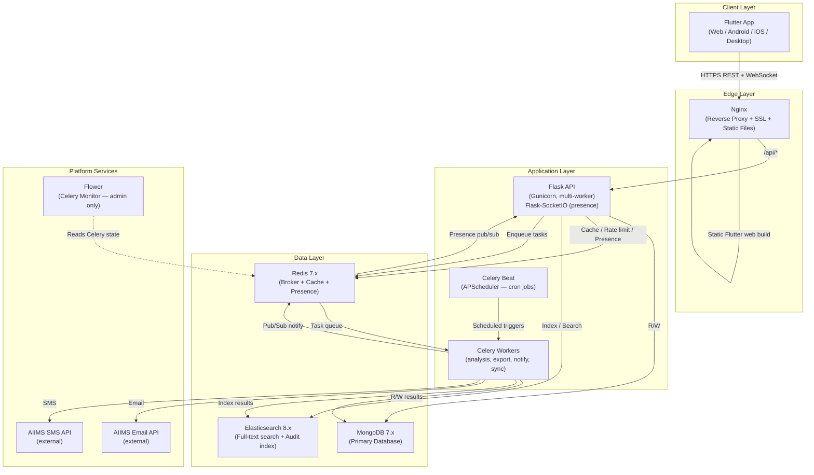

# Form Builder Platform — Project README

> **Self-hosted SaaS meta-platform** — a plugin-extensible, JSON-driven system that renders
> drag-and-drop builders for forms, analysis pipelines, and dashboards, connected by a shared
> data layer and a strict organisational hierarchy.

---

## Table of Contents

1. [What Is This Project?](#1-what-is-this-project)
2. [The Three Builders](#2-the-three-builders)
3. [Architecture Overview](#3-architecture-overview)
4. [Directory Structure](#4-directory-structure)
5. [Prerequisites](#5-prerequisites)
6. [Quick Start (Docker Compose)](#6-quick-start-docker-compose)
7. [Documentation Navigation Guide](#7-documentation-navigation-guide)
8. [Key Design Principles](#8-key-design-principles)
9. [Phase Roadmap](#9-phase-roadmap)
10. [Tech Stack Summary](#10-tech-stack-summary)
11. [How to Contribute Documentation](#11-how-to-contribute-documentation)

---

## 1. What Is This Project?

**Form Builder Platform** is a self-hosted SaaS meta-platform built for organisations that need to collect structured data, run analytical pipelines on that data, and visualise results — all within a single, permission-controlled system.

### Core Characteristics

| Characteristic | Detail |
|---|---|
| **Deployment model** | Single self-hosted server (Docker Compose), operated by the platform owner; clients access it as a SaaS web/mobile/desktop application |
| **Target scale** | 10,000 concurrent users; 1,000+ forms; 10,000–50,000 form submissions/day |
| **Billing** | No billing tiers — all features free to all approved organisations |
| **Institution context** | AIIMS (custom email/SMS HTTP APIs provided via `rpcapplication.aiims.edu`) |
| **Platform type** | Meta-platform — the builders themselves are rendered from JSON-described plugin components; new builder types can be added without modifying the platform core |

### What Makes This a "Meta-Platform"?

The platform does not hard-code any form field types, analysis node types, or dashboard widget types. Instead:

1. A **Concept Registry** defines abstract builder types (e.g., `form_field`, `analysis_node`, `dashboard_widget`).
2. **Plugins** declare which concepts they extend and ship component schemas.
3. The **Plugin Engine** loads and sandboxes plugin handlers, registers their component schemas into MongoDB.
4. The **Flutter JSON UI Engine** renders whatever components are in the registry — no Flutter code changes required to add new component types.

This means new field types, analysis algorithms, or chart widgets can be packaged as plugins and installed by the super_admin without re-deploying the application.

---

## 2. The Three Builders

### 2.1 Form Builder

The Form Builder is a drag-and-drop canvas for designing data-collection forms.

**Key capabilities:**
- **JSON-structured forms**: Forms are stored as versioned JSON commit snapshots (Git-like). Each commit includes the complete form schema: sections, sub-sections, questions, UI theme, access control settings, and webhook configurations.
- **Hierarchical structure**: Form → Sections → Sub-sections → Questions. Both sections and sub-sections can be marked `repeatable` with configurable min/max repeat counts, supporting complex data-collection scenarios (e.g., listing multiple diagnoses, multiple family members).
- **Git-like versioning**: Forms support full branching (`main` + named branches). The `production_branch` pointer determines which branch is live for response collection. Responses are pinned to the `commit_id` at time of submission, so schema changes never corrupt historical data.
- **Merge support**: Branch merging uses a 3-way merge UI. Conflict fields are surfaced per-field for manual resolution. Merge state is tracked in `pending_merges`.
- **Access control**: Per-form access type (`public`, `org`, `groups`, `users`), anonymous access flag, login requirement, and per-question visibility rules (by role, group, or answer-based conditions).
- **Rich question capabilities**: Calculations (visual formula builder → AST), skip logic (jump to section/sub-section/question/end), fetch actions (pre-fill from own previous response, another form's response, or an external API), and per-question validation rules.
- **Lifecycle controls**: Expiry date, maximum response cap, draft saving, multi-submission policy, response editing policy (no edit / role edit / time-window edit / always edit).
- **File uploads**: Resumable (tus protocol), chunked in 5 MB, virus-scanned (ClamAV), stored outside web root.

### 2.2 Analysis Coder

The Analysis Coder is a node-graph (DAG) visual builder, similar in UX to n8n or Node-RED, for building data analysis pipelines on top of collected form responses and other data sources.

**Key capabilities:**
- **Visual DAG**: Nodes have typed input/output ports. Edges connect ports. The graph is stored as a JSON array of node + edge objects in the `analyses` collection.
- **Execution engine**: Celery workers parse the DAG using NetworkX, compute a topological sort, and execute nodes in dependency order. Failing branches stop only that subgraph — other independent branches continue.
- **Execution modes** (all three required from day 1):
  - `on_demand`: User-triggered via UI button.
  - `reactive/live`: Re-runs automatically when linked forms receive new responses (debounce configurable, default 1000 ms).
  - `scheduled`: Cron expression stored per analysis, executed by Celery Beat.
- **Built-in node library** (25+ nodes across data sources, transforms, aggregations, and output types — see `CONTEXT.md §8`).
- **Export**: Results exportable as CSV, Excel (via openpyxl), or PDF (via WeasyPrint). Export jobs are queued as Celery tasks.
- **Elasticsearch integration**: Analysis run results indexed for full-text search and audit.

### 2.3 Dashboard Builder

The Dashboard Builder is a free-form canvas (Figma-style absolute positioning, resize, z-order layers) for building data visualisation dashboards fed by Analysis Coder output nodes.

**Key capabilities:**
- **Widget types**: KPI card, bar chart, line chart, pie chart, data table, text/label, image, and filter widget.
- **Data binding**: Each widget binds to a specific `analysis_id` + `node_id` (an output node). Widgets can pull from multiple analyses simultaneously.
- **Refresh modes**: Per-widget refresh mode (`with_dashboard`, `independent`, `never`). Dashboard-level auto-refresh interval is configurable (or disabled).
- **Filter widgets**: A filter widget can be linked to other widgets on the canvas, dynamically scoping the data they display.
- **Public sharing**: Dashboards can be made publicly accessible via a secure `public_token` — no login required to view.
- **Snapshots**: Point-in-time dashboard data snapshots stored in `dashboard_snapshots` for historical reporting.

### How the Three Builders Connect

```
Form Builder  →  form_responses collection
                        │
                        ▼
              Analysis Coder (DAG)
              [form_responses node reads data]
              [transforms, aggregations run]
              [output nodes produce results]
                        │
                        ▼
              analysis_results collection
                        │
                        ▼
              Dashboard Builder
              [widgets bind to output nodes]
              [display live or cached results]
```

A single analysis pipeline can join data from multiple forms, cross-reference against CSV uploads or external APIs, and feed multiple dashboards simultaneously.

---

## 3. Architecture Overview



---

## 4. Directory Structure

```
form-builder/
├── docs/                          # All documentation (this folder)
│   ├── CONTEXT.md                 # Master authoritative reference — read this first
│   ├── 00_README.md               # This file — project overview and navigation
│   ├── 01_ARCHITECTURE.md         # Full system architecture and design decisions
│   └── phases/                    # Phase-by-phase implementation plans
│       ├── phase_01_foundation.md
│       ├── phase_02_form_builder.md
│       ├── phase_03_analysis_coder.md
│       ├── phase_04_dashboard_builder.md
│       ├── phase_05_advanced_platform.md
│       └── phase_06_llm_integration.md
│
├── backend/                       # Python Flask application
│   ├── app/
│   │   ├── __init__.py            # Flask app factory
│   │   ├── config.py              # Config classes (Dev/Prod/Test)
│   │   ├── extensions.py          # Flask extension objects (db, redis, limiter, socketio…)
│   │   ├── models/                # Pydantic request/response models (NOT ORM — MongoDB is schemaless)
│   │   ├── routes/                # Blueprint-based route modules (thin — delegate to services)
│   │   │   ├── auth.py            # /api/auth/* endpoints
│   │   │   ├── orgs.py            # /api/orgs/* endpoints
│   │   │   ├── projects.py        # /api/projects/* endpoints
│   │   │   ├── forms.py           # /api/forms/* endpoints
│   │   │   ├── analysis.py        # /api/analysis/* endpoints
│   │   │   ├── dashboard.py       # /api/dashboards/* endpoints
│   │   │   ├── plugins.py         # /api/plugins/* endpoints
│   │   │   ├── admin.py           # /api/admin/* endpoints (super_admin only)
│   │   │   └── api_v1.py          # /api/v1/* public REST API
│   │   ├── services/              # Business logic layer — all DB access lives here
│   │   │   ├── auth_service.py
│   │   │   ├── form_service.py
│   │   │   ├── analysis_service.py
│   │   │   ├── dashboard_service.py
│   │   │   ├── plugin_service.py
│   │   │   ├── notification_service.py
│   │   │   ├── storage_service.py
│   │   │   ├── search_service.py
│   │   │   ├── audit_service.py
│   │   │   └── sync_service.py
│   │   ├── engines/               # Core processing engines
│   │   │   ├── form_engine.py     # Versioning, merge, diff, visibility evaluation
│   │   │   ├── analysis_engine.py # DAG execution, node runner, topological sort
│   │   │   ├── plugin_engine.py   # Plugin loader, subprocess sandbox, registry
│   │   │   ├── formula_engine.py  # AST evaluation for form calculations
│   │   │   └── notification_engine.py
│   │   ├── workers/               # Celery task definitions (all async work)
│   │   │   ├── analysis_tasks.py  # DAG execution tasks
│   │   │   ├── export_tasks.py    # CSV/Excel/PDF export tasks
│   │   │   ├── notification_tasks.py # Email/SMS/webhook delivery tasks
│   │   │   ├── sync_tasks.py      # Data sync and indexing tasks
│   │   │   └── maintenance_tasks.py  # Nightly cleanup, quota recalc, retention
│   │   ├── plugins/               # Installed plugin packages
│   │   │   ├── builtin/           # Built-in plugin packages (shipped with platform)
│   │   │   └── installed/         # Admin-installed third-party plugin packages
│   │   └── utils/
│   │       ├── security.py        # JWT helpers, bcrypt, HMAC
│   │       ├── validators.py      # Shared input validators
│   │       ├── pagination.py      # Cursor/offset pagination helpers
│   │       └── serializers.py     # BSON ObjectId ↔ JSON string helpers
│   ├── tests/
│   ├── requirements.txt
│   ├── celery_worker.py           # Celery app entry point
│   └── wsgi.py                    # Gunicorn entry point
│
├── frontend/                      # Flutter application (cross-platform)
│   ├── lib/
│   │   ├── main.dart              # App entry point
│   │   ├── app/
│   │   │   ├── router.dart        # GoRouter navigation graph
│   │   │   ├── theme.dart         # Global theme + design tokens
│   │   │   └── constants.dart     # API base URL, timeouts, etc.
│   │   ├── core/                  # Platform-wide shared infrastructure
│   │   │   ├── auth/              # Auth state, token storage, refresh logic
│   │   │   ├── models/            # Shared Dart data models (generated from JSON)
│   │   │   ├── providers/         # Core Riverpod providers (auth, org, connectivity)
│   │   │   ├── services/          # HTTP client wrappers, interceptors
│   │   │   ├── offline/           # Drift SQLite schema and DAOs
│   │   │   └── sync/              # Sync queue, conflict detection, merge UI
│   │   ├── features/              # Feature-first folder structure
│   │   │   ├── form_builder/      # Form Builder canvas + property panels
│   │   │   ├── analysis_coder/    # Node graph canvas + execution controls
│   │   │   ├── dashboard_builder/ # Free-form widget canvas
│   │   │   ├── form_viewer/       # Form rendering + response collection
│   │   │   ├── admin/             # Super_admin + org_admin management screens
│   │   │   └── notifications/     # In-app notification centre
│   │   └── shared/
│   │       ├── widgets/           # Reusable UI components
│   │       ├── json_ui_engine/    # JSON-driven primitive renderer (core of the meta-platform)
│   │       └── formula_builder/   # Visual formula builder modal (used in Form Builder)
│   ├── pubspec.yaml
│   └── tests/
│
├── docker/
│   ├── docker-compose.yml         # Development compose file
│   ├── docker-compose.prod.yml    # Production compose file (resource limits, healthchecks)
│   ├── nginx/
│   │   └── nginx.conf             # Reverse proxy config, SSL, static file serving
│   ├── backend/
│   │   └── Dockerfile
│   └── frontend/
│       └── Dockerfile             # Builds Flutter web output
│
├── scripts/
│   ├── seed.py                    # Seeds: super_admin user, built-in plugin components, concept registry
│   ├── backup.sh                  # MongoDB dump + uploads archive to backup directory
│   └── restore.sh                 # Restore from backup archive
│
├── .env.example                   # Template for all required environment variables
└── .env                           # Actual secrets (never commit)
```

---

## 5. Prerequisites

The following must be installed on the host machine before running this project:

| Prerequisite | Minimum Version | Notes |
|---|---|---|
| Docker | 24.x | Required for all services |
| Docker Compose | v2.x (plugin) | Integrated in Docker Desktop; standalone also supported |
| Git | 2.x | For cloning the repository |
| Make (optional) | any | Convenience wrapper around docker compose commands |

**For local development (without Docker):**

| Prerequisite | Version | Notes |
|---|---|---|
| Python | 3.11+ | Match the Dockerfile version |
| Flutter SDK | 3.x stable | Required for Flutter frontend development |
| Dart SDK | 3.x | Bundled with Flutter |
| MongoDB | 7.x | Or use Docker for data services only |
| Redis | 7.x | Or use Docker for data services only |
| Elasticsearch | 8.x | Or use Docker for data services only |

---

## 6. Quick Start (Docker Compose)

### Step 1 — Clone the Repository

```bash
git clone <repository-url> form-builder
cd form-builder
```

### Step 2 — Configure Environment

```bash
cp .env.example .env
# Open .env and fill in required values:
#   SECRET_KEY         — random 64-char string (use: openssl rand -hex 32)
#   JWT_SECRET_KEY     — random 64-char string (use: openssl rand -hex 32)
#   EMAIL_API_TOKEN    — AIIMS email API bearer token
#   SMS_API_TOKEN      — AIIMS SMS API bearer token
#   CORS_ORIGINS       — comma-separated list of allowed origins
nano .env
```

### Step 3 — Start All Services

```bash
# Development (with hot-reload mounts)
docker compose -f docker/docker-compose.yml up --build

# Production
docker compose -f docker/docker-compose.prod.yml up -d --build
```

This starts the following services in order:
1. `mongodb` — waits for healthy before dependent services start
2. `redis` — waits for healthy
3. `elasticsearch` — waits for healthy
4. `flask_api` — starts Gunicorn with multiple workers
5. `celery_worker` — starts worker pool (concurrency=4 by default)
6. `celery_beat` — starts APScheduler + Celery Beat for cron tasks
7. `flower` — Celery monitoring dashboard (admin access only)
8. `nginx` — starts last, serves Flutter web build and proxies API traffic

### Step 4 — Seed the Database

Run this **once** after first startup to create the super_admin user, seed the concept registry, and install built-in plugin components:

```bash
docker compose -f docker/docker-compose.yml exec flask_api python scripts/seed.py
```

The seed script outputs the generated super_admin credentials. **Save these immediately.**

### Step 5 — Access the Application

| Service | URL | Notes |
|---|---|---|
| Flutter Web App | `http://localhost` | Main application UI |
| Flask API | `http://localhost/api/` | Proxied through Nginx |
| Flower (Celery) | `http://localhost:5555` | Admin access only; not exposed to public |
| MongoDB | `localhost:27017` | Internal only — not exposed by Nginx |
| Redis | `localhost:6379` | Internal only |
| Elasticsearch | `localhost:9200` | Internal only |

> **Note**: In production, configure Nginx with SSL certificates and remove the port 5555 exposure from the compose file.

### Common Commands

```bash
# View logs for a specific service
docker compose -f docker/docker-compose.yml logs -f flask_api

# Run database backup
docker compose -f docker/docker-compose.yml exec flask_api bash scripts/backup.sh

# Restart only the API (after config change)
docker compose -f docker/docker-compose.yml restart flask_api

# Scale Celery workers
docker compose -f docker/docker-compose.yml up -d --scale celery_worker=3

# Run backend tests
docker compose -f docker/docker-compose.yml exec flask_api python -m pytest tests/

# Run Flutter tests
docker compose -f docker/docker-compose.yml exec frontend flutter test
```

---

## 7. Documentation Navigation Guide

All documentation lives in the `docs/` directory. Below is a complete map of all files and what they cover:

| File | Covers |
|---|---|
| `CONTEXT.md` | **Master authoritative reference** — ALL architectural decisions, MongoDB collections (complete schemas), tech stack, coding standards, auth system, plugin system, offline sync policy, notification system, security policies, deployment architecture. **All AI agents and contributors MUST read this first.** |
| `00_README.md` | Project overview, vision, the three builders, architecture diagram, directory structure, prerequisites, Quick Start, documentation navigation (this file), design principles, phase roadmap, tech stack summary. |
| `01_ARCHITECTURE.md` | Deep-dive system architecture: all services, request lifecycle, 5 core engines, builder data flow, meta-platform concept registry, plugin system internals, offline engine, real-time presence, Celery task routing, multi-tenancy data isolation, security layers, API versioning, and ADR decisions. |
| `phases/phase_01_foundation.md` | Phase 1 implementation plan: Docker setup, Flask shell, MongoDB, Redis, JWT auth engine, org/user CRUD, plugin engine, concept registry seeding, Flutter app shell. |
| `phases/phase_02_form_builder.md` | Phase 2 implementation plan: Form versioning engine, Form Builder UI, JSON UI Engine (all primitives), formula builder, skip logic, fetch actions, Form Viewer, offline sync, resumable uploads, templates, merge UI. |
| `phases/phase_03_analysis_coder.md` | Phase 3 implementation plan: Node graph canvas, DAG execution engine, all 25+ built-in node types, scheduled execution, Elasticsearch integration, export engine. |
| `phases/phase_04_dashboard_builder.md` | Phase 4 implementation plan: Free-form canvas, all widget types, data binding, auto-refresh, public dashboard sharing. |
| `phases/phase_05_advanced_platform.md` | Phase 5 implementation plan: Compliance registry, full notification engine, webhook system, public REST API + OAuth + API keys + rate limiting, storage quota, update mechanism, admin panel, audit log archiving. |
| `phases/phase_06_llm_integration.md` | Phase 6 implementation plan: LLM as analysis node, LLM form builder assistant, natural language dashboard queries. |
| `17_HISTORY_LOOKUP.md` | Keyed response lookup ("History"): form/question configuration, lookup behavior, privacy rules, API contract, and patient ID example. |
| `18_QUICK_RESPONSES.md` | Quick Responses / response presets: reusable template management, selection rules, permissions, and conflict handling. |

> **How to use this documentation**: Start with `CONTEXT.md` to understand all architectural decisions. Then read `01_ARCHITECTURE.md` for system design. Then read the relevant `phases/` file for the feature you are implementing.

---

## 8. Key Design Principles

### 8.1 Meta-Platform (Plugin-Extensible)

The platform is not a form builder — it is a **meta-platform that renders builders**. The three builder types (form, analysis, dashboard) are not hard-coded; they are rendered from component schemas registered in the Concept Registry. New builder types, new field types, new node types, and new widget types can be shipped as plugins without modifying any core platform code.

This means:
- A medical institution can install a "DICOM Viewer" form field as a plugin.
- A data team can install a custom "ML Inference" analysis node.
- The Flutter UI renders whatever is in the registry — zero native code changes required.

### 8.2 JSON-Driven Everything

All builder artifacts are JSON:
- Form schemas (sections, questions, visibility rules, skip logic, calculations) are stored as JSON in MongoDB.
- Analysis pipelines (node graphs) are JSON.
- Dashboard layouts (widget positions, data bindings) are JSON.
- Plugin component schemas (properties, ports, composition) are JSON.
- The Flutter rendering engine interprets these JSON structures at runtime.

This design enables:
- Version-controlled form diffs (compare two JSON snapshots).
- Git-like branch and merge operations on form schemas.
- Platform-independent export and import of builder artifacts.

### 8.3 Offline-First (Flutter)

The Flutter app is designed to work fully offline for form collection use cases. The offline engine uses **Drift (SQLite)** for local storage and maintains a **sync queue** that is flushed when connectivity is restored. Key offline behaviors:

- Form schemas are synced to device on first access and kept up-to-date.
- Response drafts are saved locally and submitted when online.
- File uploads use the **tus resumable upload protocol** — interrupted uploads resume from the server-reported byte offset.
- Old-schema offline submissions are accepted and tagged `is_legacy: true`.
- Conflict detection uses optimistic locking via `base_commit_id`.

### 8.4 Strict Organisational Hierarchy

Every resource in the system belongs to an organisation (`org_id`). The hierarchy is:

```
Platform (super_admin)
  └── Organisations (org_admin, org_editor, org_analyst, org_viewer)
        └── Projects (project_owner, project_editor, project_analyst, project_viewer)
              ├── Forms
              ├── Analyses
              └── Dashboards
```

Access control is **Attribute-Based (ABAC)** and evaluated in this order:
1. `super_admin` system role bypasses all checks.
2. Org membership + role is checked for the resource's `org_id`.
3. Project membership + role is checked.
4. Form-level access settings are checked.
5. Per-question visibility rules (role-based and answer-based) are evaluated at render time.

### 8.5 Separation of Concerns (Routes → Services → Engines)

The backend enforces a strict three-layer architecture:

| Layer | Responsibility | Rule |
|---|---|---|
| **Routes** (Blueprints) | HTTP parsing, auth decoration, response serialisation | Must be thin — no business logic |
| **Services** | All business logic; all MongoDB queries | Only layer allowed to touch the DB |
| **Engines** | Stateless computational cores (DAG execution, form versioning, plugin sandboxing) | Called by services; no DB access directly |

### 8.6 Append-Only Audit Log

The `audit_logs` collection is append-only — it has no delete API endpoint. Every significant state change produces an audit log entry with `before` and `after` snapshots. This is non-negotiable for compliance (HIPAA enforces it). Super_admin can configure archival to cold storage beyond a retention threshold.

---

## 9. Phase Roadmap

| Phase | Name | Core Deliverables | Status |
|---|---|---|---|
| **Phase 1** | Foundation | Docker + compose, Flask app shell, MongoDB + Redis + ES setup, JWT auth (login, refresh, invite), Org and User CRUD, ABAC middleware, Plugin Engine (loader + sandbox + registry), Concept Registry seeding, Flutter app shell (router, auth screens, org switcher), Audit log | Planned |
| **Phase 2** | Form Builder | Form versioning engine (commit, branch, merge, diff), Form Builder UI (drag-drop canvas, property panels), JSON UI Engine (all 30+ Flutter primitives), Visual formula builder, Skip logic editor, Fetch action button, Form Viewer + response collection, Draft save + offline sync (basic), Resumable file uploads (tus), Form templates, Git-style 3-way merge UI | Planned |
| **Phase 3** | Analysis Coder | Node graph canvas (DAG), DAG execution engine (Celery, NetworkX, topological sort), All 25+ built-in node types (data sources, transforms, aggregations, outputs), Scheduled execution (Celery Beat + APScheduler), Reactive execution (response submission triggers), Elasticsearch indexing, Export engine (CSV, Excel, PDF via WeasyPrint), Analysis result caching + run history | Planned |
| **Phase 4** | Dashboard Builder | Free-form canvas (absolute positioning, resize, z-order, layers), All widget types (KPI, bar/line/pie chart, table, text, image, filter), Data binding to analysis output nodes, Auto-refresh (dashboard-level + per-widget), Public dashboard sharing (secure token), Dashboard snapshots | Planned |
| **Phase 5** | Advanced Platform | Compliance registry + behavioral enforcement (GDPR, HIPAA, ISO 27001), Full notification engine (email, SMS, in-app, push, webhook), Webhook system + delivery log + HMAC signing, Public REST API (`/api/v1/`) + OAuth 2.0 clients + API keys + rate limiting, Storage quota management + warnings, Docker self-update mechanism, Full admin panel, Audit log full-text search + archiving to cold storage | Planned |
| **Phase 6** | LLM Integration | LLM as analysis node type (call external LLM API, feed response data), LLM-assisted form builder (suggest fields from description), Natural language dashboard queries (NL → filter/sort parameters) | Planned |

---

## 10. Tech Stack Summary

### Backend

| Technology | Version | Purpose |
|---|---|---|
| Python | 3.11+ | Language |
| Flask | 3.x | REST API framework |
| Gunicorn | latest | WSGI server, multi-worker |
| Celery | 5.x | Background task queue |
| APScheduler | 3.x | Cron scheduling inside Celery |
| MongoDB | 7.x | Primary database (schemaless, JSON-native) |
| PyMongo / Motor | latest | MongoDB driver (Motor for async paths) |
| Redis | 7.x | Celery broker, cache, rate limiting, presence pub/sub |
| Flask-SocketIO | latest | WebSocket server (real-time presence awareness only) |
| Elasticsearch | 8.x | Full-text search across responses + audit logs |
| WeasyPrint | latest | PDF export generation |
| NetworkX | latest | DAG graph parsing and topological sort for analysis engine |
| python-jose | latest | JWT creation and validation |
| Flask-Limiter | latest | API rate limiting (backed by Redis) |
| Nginx | latest | Reverse proxy, SSL termination, static file serving |

### Frontend

| Technology | Version | Purpose |
|---|---|---|
| Flutter | 3.x stable | Cross-platform app (Web, Android, iOS, Desktop) |
| Dart | 3.x | Language |
| Riverpod | 2.x | Reactive state management |
| Drift | latest | Local SQLite offline database (type-safe, code-generated) |
| http / dio | latest | HTTP client with interceptors |
| flutter_secure_storage | latest | Secure JWT token storage (Keychain / Keystore) |
| socket_io_client | latest | WebSocket client for real-time presence |
| tus_client | latest | Resumable chunked file uploads (tus protocol) |

### Infrastructure

| Technology | Purpose |
|---|---|
| Docker + Docker Compose | Container orchestration for all services |
| Nginx | Reverse proxy, SSL termination, Flutter web static file server |
| Redis | Shared broker (Celery tasks) + cache (API responses) + pub/sub (presence) |
| Elasticsearch | Full-text search index + analysis result indexing |

---

## 11. How to Contribute Documentation

All documentation for this project lives in `docs/`. The file `CONTEXT.md` is the **immutable architectural source of truth** and must not be modified without a team decision. All other documentation files must be consistent with `CONTEXT.md`.

### Documentation Standards

1. **Read `CONTEXT.md` first** — always, before writing or editing any documentation file.
2. **Be exhaustive** — documentation should be detailed enough for a senior developer (or an AI agent) to implement the feature without asking follow-up questions. Include field names, types, enum values, edge cases, error codes, and example payloads.
3. **Use clear structure** — headers, tables, code blocks, and bullet points. Avoid walls of prose.
4. **Never contradict `CONTEXT.md`** — if `CONTEXT.md` specifies `MongoDB 7.x`, do not write `MongoDB 6.x` in a doc file. If something is genuinely not specified in `CONTEXT.md`, use sound engineering judgment consistent with the existing decisions.
5. **Document decisions, not just actions** — use the ADR (Architecture Decision Record) format for significant choices: state the context, the decision, and the rationale.

### File Naming Convention

| Pattern | Use case |
|---|---|
| `00_README.md`, `01_ARCHITECTURE.md` | Top-level docs (numbered for ordering) |
| `phases/phase_NN_<name>.md` | Phase implementation plans |
| `api/` subdirectory | API endpoint reference docs (if created) |
| `schemas/` subdirectory | Detailed data schema docs (if created) |

### Contribution Workflow

```bash
# 1. Create a new branch
git checkout -b docs/add-phase-02-plan

# 2. Write the documentation file
# 3. Verify it does not contradict CONTEXT.md
# 4. Submit a pull request with a summary of what was documented
```

> **For AI agents**: When assigned to write documentation for this project, always invoke `view_file` on `/home/ravi/workspace/form-builder/docs/CONTEXT.md` as the very first action before writing any content. This file is the single authoritative source for all architectural decisions.
