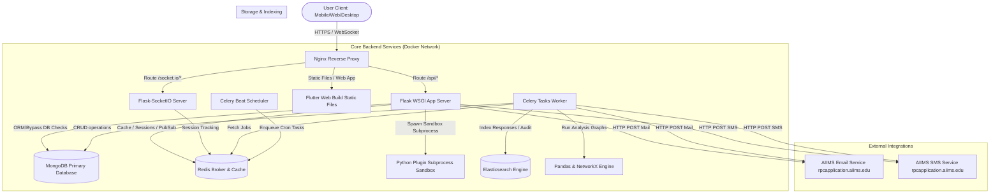

# 01 — Architecture Overview

This document describes the high-level architecture of the Form Builder Platform, covering both backend services and frontend clients, as well as the design principles and integration points.

---

## 1. System Overview

The Form Builder Platform is a self-hosted SaaS meta-platform. It comprises a Python Flask REST API server, Celery workers for asynchronous processing, and a Flutter frontend client compiled for multiple target platforms.

### 1.1 Complete Architecture Diagram

The diagram below represents all systems, components, data flows, and service bounds.

---

## 2. Request Lifecycle

Here is how a standard HTTP request flows from the client to the backend and back.

1. **Client Request**: The Flutter client performs an HTTP request (e.g., `POST /api/internal/v1/forms/submit`) with a JWT header.
2. **Reverse Proxy (Nginx)**: Nginx intercepts the request, handles TLS validation, decompresses gzip headers if any, and proxies the request to the Gunicorn/Flask service on port 5000.
3. **Flask Middleware**:
   - **Rate Limiter**: `Flask-Limiter` verifies IP/token limits via Redis.
   - **Authentication Middleware**: Extracts the JWT, validates signature using `python-jose`, checks token revocation registry in Redis, and stores the user context (`g.current_user`) in Flask thread-locals.
   - **ABAC Authorization**: An access control decorator checks whether the user role has permission to access the specified resource within the scope of their `org_id`.
   - **Audit Logger**: A hook logs the endpoint signature, actor, timestamps, and parameters, pushing an audit document asynchronously to MongoDB.
4. **Service / Engine layer**: The route handler extracts parameters, passes them to `form_service.py` or the `form_engine.py` logic which handles JSON checks, validation, and schema version pinning.
5. **Database / Storage**: Data is saved or queried using PyMongo/Motor from MongoDB.
6. **Response Generation**: The service serializes response objects to JSON, passes them through Flask blueprints, and returns the response payload with HTTP status codes and API version headers.

---

## 3. The 5 Core Engines

### 3.1 Auth Engine (`auth_engine.py` / ABAC decorator)
Responsible for computing roles, user token authentication, invitation lifetimes, and evaluating Attribute-Based Access Control (ABAC) policies. It evaluates the access rules (e.g. comparing user roles, organization scopes, and specific project assignment keys) before allowing resources to load.

### 3.2 Plugin Engine (`plugin_engine.py`)
Scans, loads, and manages lifecycle transitions of plugins. It executes backend calculations or transforms by spawning a sandboxed Python subprocess. It restricts builtins inside the sandbox to prevent unauthorized filesystem access, and injects an org-scoped database wrapper.

### 3.3 Form Engine (`form_engine.py`)
Processes form structures (Sections → Subsections → Questions). It handles Git-like versioning (branches, commits, tree diffs, merges) and compiles the final form representation from JSON properties.

### 3.4 Analysis Engine (`analysis_engine.py`)
Parses visual node graphs (Directed Acyclic Graphs) from nodes and edges. It performs topological sorts using `NetworkX` and manages execution branches on Celery workers, isolating failures so independent paths continue to completion.

### 3.5 Notification Engine (`notification_engine.py`)
Evaluates system events against rules defined by organizations or form owners. It generates custom message text via templates and routes SMS, emails, push notices, and webhooks to their respective delivery agents with automatic fallback mechanisms.

---

## 4. Connection Between Builders (Data Flow)

The three builders are integrated sequentially:
1. **Form Builder**: Defines structural JSON templates, which are published to a specific commit. Users submit form responses pinned to that commit.
2. **Form Responses**: Submissions are saved as raw JSON objects in the `form_responses` collection, then indexed in Elasticsearch for fast retrieval.
3. **Analysis Coder**: Pulls from the response datasets as data sources, routes values through transformation nodes, and caches results to `analysis_results`.
4. **Dashboard Builder**: Binds visual widgets directly to outputs in the cached analysis results, refreshing automatically on websocket triggers or page reloads.

---

## 5. Offline Architecture (Flutter)

Flutter uses a dual-engine architecture:
- **Online mode**: Fetches schemas and submits responses directly to Flask via standard REST APIs.
- **Offline mode**: Saves response drafts, local files, and schemas inside a local SQLite database powered by `Drift`.
- **Sync Queue**: A local task queue intercepts submissions when `connectivity_plus` detects connection loss. Once online state resumes, the client triggers the `SyncManager` to upload changes sequentially. Resumable files are sent in chunks via the `tus` protocol.

---

## 6. Real-time Presence (Flask-SocketIO)

To prevent edit collisions, we use Flask-SocketIO backed by a Redis pub/sub broker:
- When an editor opens a form/analysis/dashboard, a connection event joins a room named `{entity_type}_{entity_id}`.
- Ephemeral session keys are logged in Redis with a 60s TTL.
- Other active users in the same room are notified of editing presence. A heartbeat mechanism refreshes the lease.

---

## 7. Key Architectural Decisions (ADRs)

### ADR 001: JSON-driven UI Rendering
- **Context**: The platform needs to support arbitrary form inputs and custom builder structures on web, mobile, and desktop without requiring code compilation or dynamic Dart injection.
- **Decision**: Form structure and widget properties are stored as structured JSON. Flutter contains a built-in interpreter (`JSON UI Engine`) that reads properties and maps them directly to compiled Dart widgets.
- **Consequences**: Adding brand new field layouts requires a schema upgrade or a plugin registration containing the schema definition.

### ADR 002: Subprocess Sandbox for Plugins
- **Context**: Dynamic custom plugins execute Python code, which presents a security threat if run in the main server process.
- **Decision**: Plugin Python code is run in isolated subprocesses using a restricted environment wrapper that strips unsafe builtins (e.g. `open`, `eval`, `importlib`).
- **Consequences**: Minimal overhead, strong process separation, and isolation of exceptions.

### ADR 003: Soft Delete and Org Scoping
- **Context**: Shared multi-tenant model. Accidental deletions must be reversible.
- **Decision**: Every document includes an `org_id` and `is_deleted` field. Queries default to filtering `{org_id: current_org_id, is_deleted: false}`.
- **Consequences**: Simple data integrity safety nets, but requires developer discipline to ensure all filters include both criteria. This is enforced via automated test assertions.
