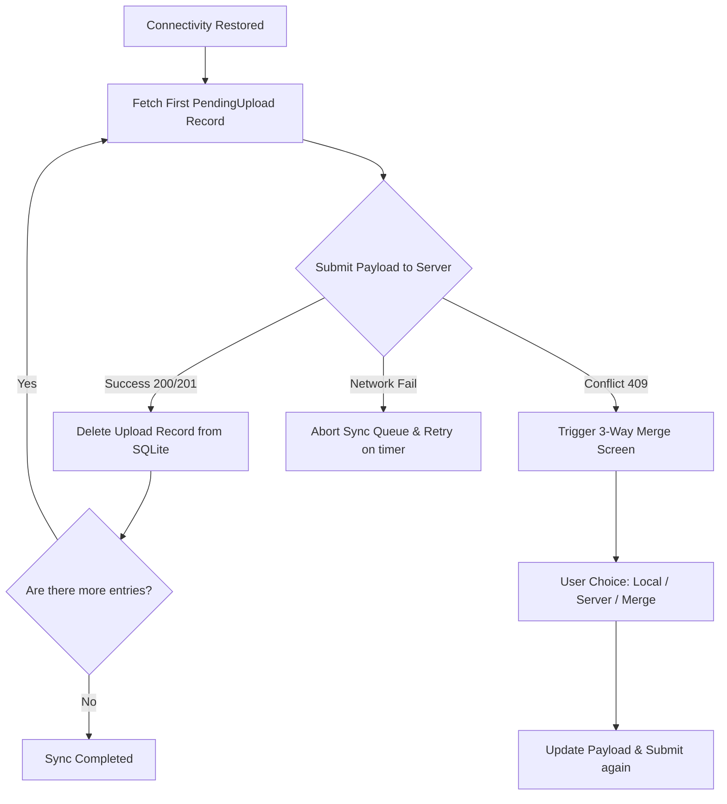

# 10 — Offline Sync System

This document specifies the offline sync architecture, local client-side SQLite storage (via Drift), delta synchronization mechanics, and validation policies for sync operations.

---

## 1. Storage Layers (Online vs. Offline)

| Data Class | Local Cache Store (Drift) | Sync Strategy |
|---|---|---|
| **User Settings / Profile** | Yes | Read-only cache. |
| **Form Schemas** | Yes | Synced on launch, stored locally to render viewer forms. |
| **Response Drafts** | Yes | Saved locally until submission. |
| **Pending Upload Queue** | Yes | Append-only execution steps for offline edits. |
| **Audit Logs** | No | Server-only; never cached on local storage. |

---

## 2. SQLite Schema Blueprint (Drift)

The Drift SQLite model matches key schema properties from MongoDB:

```dart
import 'package:drift/drift.dart';

class CachedForms extends Table {
  TextColumn get id => text()();
  TextColumn get orgId => text()();
  TextColumn get name => text()();
  TextColumn get activeSchemaJson => text()();
  DateTimeColumn get lastSyncedAt => dateTime()();
  BoolColumn get isDeleted => boolean().withDefault(const Constant(false))();

  @override
  Set<Column> get primaryKey => {id};
}

class PendingUploads extends Table {
  IntColumn get id => integer().autoIncrement()();
  TextColumn get actionType => text()(); // 'create_response' | 'save_draft' | 'edit_response'
  TextColumn get payloadJson => text()();
  DateTimeColumn get createdAt => dateTime()();
  IntColumn get attemptCount => integer().withDefault(const Constant(0))();
}

class CachedResponses extends Table {
  TextColumn get id => text()();
  TextColumn get formId => text()();
  TextColumn get answersJson => text()();
  DateTimeColumn get savedAt => dateTime()();
  BoolColumn get isSynced => boolean().withDefault(const Constant(false))();

  @override
  Set<Column> get primaryKey => {id};
}
```

---

## 3. Delta Synchronization Watermark Engine

Synchronization keeps a local watermark timestamp to query new records:

1. **Query watermark**: On connection launch, check `last_synced_at` from `CachedForms`.
2. **Fetch delta changes**: Make a GET request: `/api/internal/v1/sync?last_synced_at=TIMESTAMP`.
3. **Delta payload shape**:
   ```json
   {
     "updated": [
       { "id": "603d4a259c6b8c2c5c994550", "name": "Patient Update" }
     ],
     "deleted": ["603d4a259c6b8c2c5c994551"]
   }
   ```
4. **Local Database update**: Apply updates and delete references from SQLite. Update `last_synced_at` to the server timestamp.

---

## 4. Conflict Resolution & Sync Execution Queue

When connectivity is restored, the `SyncManager` processes operations sequentially:



* **Optimistic Locks**: Form responses carry a version pointer `commit_id`. If the server target production commit changes during offline filling, submission triggers a 409 Conflict state.
* **Resumable Files**: Large files use chunked upload via the `tus` client protocol. The client records offsets in Drift. If connection drops, it resumes from the saved byte offset instead of starting over.

---

## 5. Tombstone Deletion Sync Protocol

To clean up offline client caches when records are deleted on the server, the synchronization engine relies on a dedicated **Tombstones** database log collection on the server.

### 5.1 MongoDB Tombstone Collection (`tombstones`)
Every time a form, project, or response is deleted permanently, an entry is added:
```json
{
  "_id": "ObjectId",
  "org_id": "ObjectId",
  "entity_type": "String (enum: forms | responses | projects)",
  "entity_id": "ObjectId",
  "deleted_at": "ISODate"
}
```

### 5.2 Watermark Tombstone Query
The synchronization payload from Section 3 is expanded to include a `tombstones` section querying deletions since the last sync watermark:
```json
{
  "updated": [
    { "id": "603d4a259c6b8c2c5c994550", "name": "Patient Update" }
  ],
  "tombstones": [
    { "entity_type": "forms", "entity_id": "603d4a259c6b8c2c5c994551" },
    { "entity_type": "responses", "entity_id": "603d4a259c6b8c2c5c9949aa" }
  ]
}
```

### 5.3 Client-Side SQLite Garbage Collection
Upon receiving the payload, the client maps `tombstones` and purges matching records from the Drift database:
```dart
Future<void> applyTombstones(List<Tombstone> tombstones) async {
  await batch((zone) {
    for (var tombstone in tombstones) {
      if (tombstone.entityType == 'forms') {
        zone.delete(cachedForms).where((tbl) => tbl.id.equals(tombstone.entityId));
      } else if (tombstone.entityType == 'responses') {
        zone.delete(cachedResponses).where((tbl) => tbl.id.equals(tombstone.entityId));
      }
    }
  });
}
```
This ensures hard deletes on the server are fully garbage-collected on local devices.

